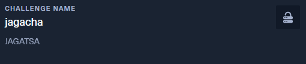

# jagacha - STF22 Crypto Challenge

Here is the challenge task:



Took this challenge task during the playground (write-up) period after 
the event ended; does not seem to be the original challenge task.


Files: [`jagacha.py`](jagacha/jagacha.py), 
[`config.py`](jagacha/config.py)

## Overview

For this challenge, the source code of the challenge is provided.
From the name and original challenge task, the theme of the challenge is
geared towards gacha - a term akin to lootboxes in games. I will later 
realise that this is a seemingly standard crypto challenge using an 
insecure Pseudo-Random Number Generator (PRNG).

Upon connecting to the challenge network, you will be greeted by the menu.
```
$ nc 157.245.52.169 31841
Welcome to the Jaga Gacha!
We have an event going on featuring the limited SSS-rarity flag-chan!
Here are the Gacha pull rates:
- Jaga-chan: 25 %
- Jaga Hacker: 25 %
- Jaga Scholar: 25 %
- Super Jaga: 25 %
- flag-chan: 0 %
All the best!

Options:
1. Roll a Gacha
2. I'm Feeling Lucky!
3. Exit
> 
```

The goal here is obtain *flag-chan* which has a 0% chance of appearing via
option 1. The flag only appears when you guess a 64-bit number correctly
in option 2.

```py
elif option == 2:
    num = rand.getrandbits(64)
    lucky_number = await read_number(
        reader, writer, b"Enter your lucky number: "
    )
    if lucky_number == num:
        writer.writelines((
            b"Congrats! You have pulled the limited SSS-rated rarity flag-chan!\n",
            FLAG,
        ))
        option = 3  # Quit
    else:
        writer.write(
            b"Oops! Looks like you are not as lucky as you thought! Try again!\n\n"
        )
```

Since it is my first encounter with this type of challenge, I went on a
journey down the Google rabbit hole. From there, I realise that there are
several results describing Python's `random` library to be cryptographically
insecure.

It was noted that Python's `random` library was making use of 
[`Mersenne Twister (MT19937)`](https://en.wikipedia.org/wiki/Mersenne_Twister) 
algorithm as its PRNG. This algorithm is deterministic in
nature and generates a predictable sequence of 32-bit numbers by using a 
certain seed and state. This means that attackers with that seed is able to 
accurately predict the numbers generated.

The seed can be reversed by observing 624 32-bit numbers generated by the
PRNG in a given state. The state of the PRNG changes after producing 624
32-bit numbers which means that every number generated by a single state is
required.
There are available libraries/repos that assist with this process, and I 
made use of the 
[`RandCrack`](https://github.com/tna0y/Python-random-module-cracker) 
repo which available on pip.

Luckily for us, the generated random number is leaked via option 1.

```py
if option == 1:
    num = rand.getrandbits(64)
    gacha = GACHA_KEYS[num % len(GACHA_KEYS)]
    writer.writelines(
        (
            f"Congrats! You have pulled a {gacha}!\n".encode(),
            GACHAS[gacha],
            b"Here are the stats of your character:\n",
            f"STR: {num>>48 & 0xffff}\n".encode(),
            f"DEX: {num>>32 & 0xffff}\n".encode(),
            f"INT: {num>>16 & 0xffff}\n".encode(),
            f"LUK: {num & 0xffff}\n".encode(),
            b'\n',
        )
    )
```

The next issue is that the leak is for 64-bit numbers instead of the 
expected 32-bit numbers. From some extra searching and testing, I found that
the 64-bit random number is just a concatenation of two 32-bit random 
numbers.

```py
import random, time
def get_seed():
    SEED = 0xdeadc0de
    return SEED + time.time_ns()
seed = get_seed()
rand1 = random.Random(seed)
r1 = rand1.getrandbits(32)
r2 = rand1.getrandbits(32)
rand2 = random.Random(seed)
num = rand2.getrandbits(32)
print(num == (r2 << 32) + r1) # True
```

Now that we have all the information we need, we can start crafting the
solution script in [solver.py](solver.py).

## Solution

First, we import the relevant libraries and setup our helper functions
and variables.

```py
import random, time
from pwn import *
from randcrack import RandCrack

def recvnum(r):
    return int(r.recvline().strip().decode().split()[1])

r = remote('157.245.52.169', 31841)
rc = RandCrack()
```

From here, we repeat 312 times of option 1 to obtain our 624 32-bit numbers
via bit shifts and addition. The variable names matches those printed by 
[`jagacha.py`](jagacha/jagacha.py) for simplicity of ordering.

> :exclamation: Note that the order of the 32-bits being served to 
`RandCrack()` is 
important. The sequence needs to be analysed **chronologically** which 
means that the lower 32-bits needs to be served first.

```py
for _ in range(312):
    r.sendline(b"1")
    r.recvuntil(b"your character:\n", timeout=1)
    STR = recvnum(r)
    DEX = recvnum(r)
    INT = recvnum(r)
    LUK = recvnum(r)
    
    r2 = (STR << 16) + DEX
    r1 = (INT << 16) + LUK
    rc.submit(r1)
    rc.submit(r2)
```

Making use of randcrack, we craft the predicted 64-bit lucky number and
send it to the challenge server.

```py
r1 = rc.predict_getrandbits(32)
r2 = rc.predict_getrandbits(32)
r3 = (r2 << 32) + r1

r.sendline(b"2")
r.recvuntil(b"Enter your lucky number:")
r.sendline(str(r3))
r.interactive()
```

And finally, we get our *flag-chan*.

```
$ solver.py
[x] Opening connection to 157.245.52.169 on port 31841
[x] Opening connection to 157.245.52.169 on port 31841: Trying 157.245.52.169
[+] Opening connection to 157.245.52.169 on port 31841: Done
[*] Switching to interactive mode
 Congrats! You have pulled the limited SSS-rated rarity flag-chan!
STF22{W@IFU5_L@1FU5}
[*] Got EOF while reading in interactive
[*] Closed connection to 157.245.52.169 port 31841
```