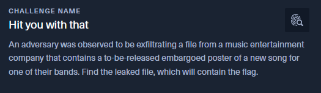
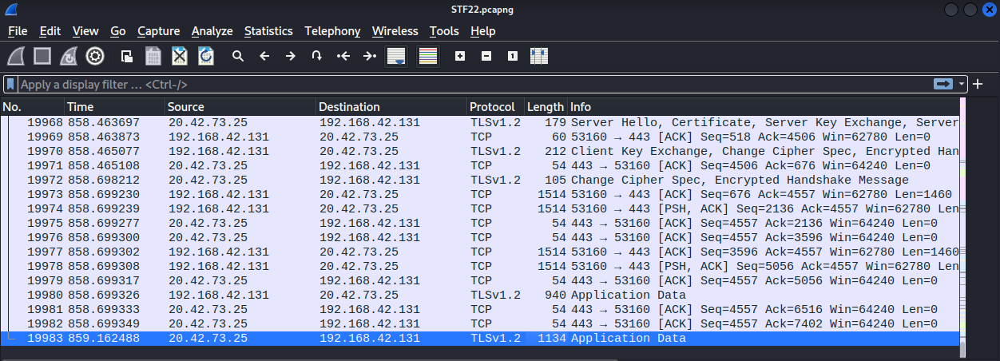
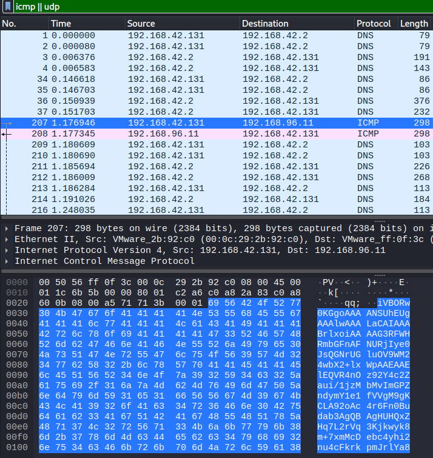
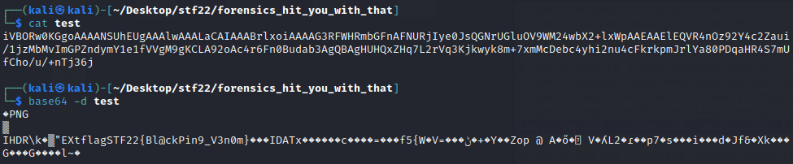

# Hit you with that - STF22 Forensics Challenge

Here is the challenge task:

Files: [`STF22.pcapng`](STF22.pcapng)

## Overview

For this challenge, a pcap file is provided for our searching. This
pcap captured has 19983 packets and we are tasked to identify the file
that is being exfiltrated.

Expecting the file to be exfiltrated through TCP means, I filtered away UDP
packets and packets that I assume to be noise. 

After slowly going through quite a number of packets, I decided to 
backtrack on that idea and take a look at the ICMP and UDP packets only.
With that, I was greeted with the first ICMP packet which contains 
suspicious looking data.

We can extract only the data bytes by selecting the packet and export via
`File --> Export Packet Bytes`. 

After some trial and error, we managed to decode the bytes using base64. 
The base64 decoded bytes reveals the name of the leaked file which also 
happens to be the flag that we are looking for.

