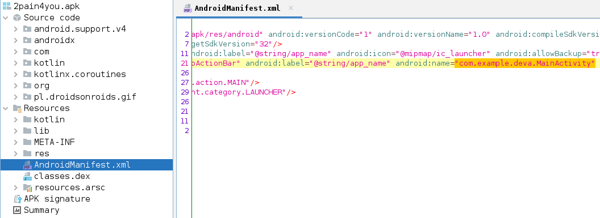

# 2 Pain - STF22 Miscellaneous Challenge

Here is the challenge task:


Files: [`2pain4you.apk`](2pain4you.apk)

## Overview

For this challenge, an APK file is provided. We can explore this APK by 
decompiling it with 
[`jadx`](https://github.com/skylot/jadx).
For ease of navigation, the GUI version was used.

First step is to check the manifest to the relevant package.



Inside the package, we noted several interesting looking classes which
seems relevant to the challenge task.


The first class, `defendTheVilalge`, contains a function which seems to be
a decryption algorithm. Another class `rightOfPassage` seems to be its
counterpart encryption algorithm which saves the encrypted string and
relevant IV and specs seeds somewhere.


Going through the `pain` class, we see a byte array and string which
we can feed into the `releasepain()` decryption function. From the hints
in this class, it seems that the `stinger` variable is encoded in base64
but with its first character missing.


We can bruteforce the first character in a base64 decoder to find the actual
value of the string.


Now that we have all the information we need, we can start crafting the
solution script in [mydecrypt.java](mydecrypt/mydecrypt.java).

## Solution

For the solution, we copy out the code from the `defendTheVillage` class
and replace the byte array and string arguments with those we found from
the `pain` class.

When ran, the flag will be successfully decrypted.

```java
package mydecrypt;

import java.security.MessageDigest;
import javax.crypto.Cipher;
import javax.crypto.spec.IvParameterSpec;
import javax.crypto.spec.SecretKeySpec;

class MyDecrypt {
    public static void main(String[] args) throws Exception {
        byte[] bArr = {-55, -98, 98, 14, -121, -110, 84, -3, 74, 10, 106,
         -27, -13, -112, -42, 111, -1, -89, -64, 46, -15, -108, -26, 59, 
         -111, 113, 2, -69, -83, 45, -31, -103, 46, -84, -113, 116, -110, 
         -36, 22, -23, 86, 38, -17, 0, 100, -65, 94, 48, 76, 17, 35, -117, 
         -51, -81, -95, 49, 62, -28, 96, 86, 65, 76, 57, 40};
        String str = "this-issa-weird-key";

        byte[] bArr2 = new byte[16];
        System.arraycopy(bArr, 0, bArr2, 0, 16);
        IvParameterSpec ivParameterSpec = new IvParameterSpec(bArr2);
        int length = bArr.length - 16;
        byte[] bArr3 = new byte[length];
        System.arraycopy(bArr, 16, bArr3, 0, length);
        byte[] bArr4 = new byte[16];
        MessageDigest messageDigest = MessageDigest.getInstance("SHA-256");
        messageDigest.update(str.getBytes());
        System.arraycopy(messageDigest.digest(), 0, bArr4, 0, 16);
        SecretKeySpec secretKeySpec = new SecretKeySpec(bArr4, "AES");
        Cipher cipher = Cipher.getInstance("AES/CBC/PKCS5Padding");
        cipher.init(2, secretKeySpec, ivParameterSpec);
        System.out.println(new String(cipher.doFinal(bArr3)));
    }
}
```

```
$ java mydecrypt.java         
STF22{f33l_p41n_4nd_n0w_y0u_w1ll_kn0w_0urs}
```