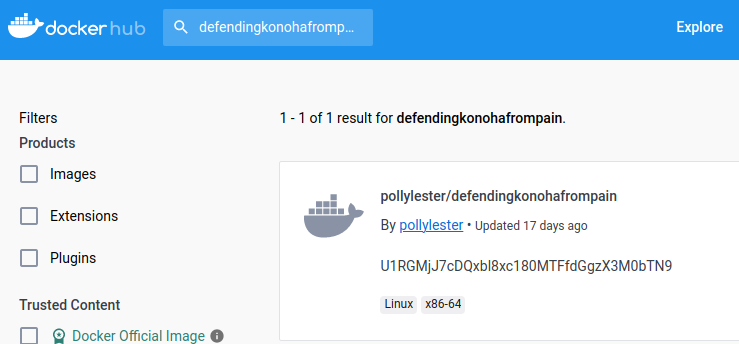

# 4 Paths of Pain - STF22 Miscellaneous Challenge

Here is the challenge task:


Files: `NIL`

## Overview

For this challenge, no files are provided. From the challenge name, one
can guess that there are several hoops we have to jump through.

Accessing the provided URL and looking around, we spot our first clue
in the page's source. There is a hidden button that leads us to
`/?nopain=haha`.


We followed that path and observed that values of the `nopain=` argument
is being reflected onto the page. This means that some form of input
injection is likely.


Probing around with reflected javascript for awhile lead to no 
conclusions. This lead to a brief scanning attempt which revealed
that Server-Side Template Injection (SSTI) is possible and that
the server likely uses `Jinja2` as its template engine.


From there, it was found that `Jinja2` can be susceptible to remote
code execution and a valid attack was found. The attack looks for and
imports the `os` module and uses it to execute and return an arbitrary
system command such as `ls`.

```py
{{x()._module.__builtins__['__import__']('os').popen("ls").
read()}}
```


This revealed the server's web application in `app.py` and allowed us
to read its contents, revealing a path that allows us to download a
file named `blueprint.img`. In the context of the challenge task, this
is the next hint that we need - possibly the blueprint to their secret
weapon.

```py
@app.route('/defendthevillagefrompain', methods=['GET']) 
def page3(): 
    try: 
        return send_file('./blueprint.img') 
    except Exception as e: 
        return str(e) 
```

Checking the blueprint with the `file` command reveals that it is a tar archive and its contents were extracted. This reveals several unfamiliar
looking files with me not being accustomed to this part of Docker.

```
$ file blueprint.img
blueprint.img: POSIX tar archive

$ tar -xvf blueprint.tar
23202ee5821e24d35c5207fc2b00ccff278c5cc45200aa218e18d09b0823b148/
23202ee5821e24d35c5207fc2b00ccff278c5cc45200aa218e18d09b0823b148/VERSION
23202ee5821e24d35c5207fc2b00ccff278c5cc45200aa218e18d09b0823b148/json
23202ee5821e24d35c5207fc2b00ccff278c5cc45200aa218e18d09b0823b148/layer.tar
5311c2bdad7ed9ff9a45d89fbf5f6fd3396eba77024356054e44ea3b2965f0a0/
5311c2bdad7ed9ff9a45d89fbf5f6fd3396eba77024356054e44ea3b2965f0a0/VERSION
5311c2bdad7ed9ff9a45d89fbf5f6fd3396eba77024356054e44ea3b2965f0a0/json
5311c2bdad7ed9ff9a45d89fbf5f6fd3396eba77024356054e44ea3b2965f0a0/layer.tar
54b399bd0253b7800f4c81d5d800917be6cd2345be7030947a7efd9bb4f60043/
54b399bd0253b7800f4c81d5d800917be6cd2345be7030947a7efd9bb4f60043/VERSION
54b399bd0253b7800f4c81d5d800917be6cd2345be7030947a7efd9bb4f60043/json
54b399bd0253b7800f4c81d5d800917be6cd2345be7030947a7efd9bb4f60043/layer.tar
786fa91039940fa3967fb214d152d1b933d6d83dc1dfbc53c70aaceda221c391.json
d0ffc5a8edc8aafbc7f44c0f04ccb85285593f89e3b5dd3eb3525e39e53a06cb/
d0ffc5a8edc8aafbc7f44c0f04ccb85285593f89e3b5dd3eb3525e39e53a06cb/VERSION
d0ffc5a8edc8aafbc7f44c0f04ccb85285593f89e3b5dd3eb3525e39e53a06cb/json
d0ffc5a8edc8aafbc7f44c0f04ccb85285593f89e3b5dd3eb3525e39e53a06cb/layer.tar
manifest.json
repositories
```

This was the start of some rabbit holes where the contents of the files
were being checked slowly. Eventually, noticing that these are files
extracted from a Docker project.

One can load these files back into a docker project and executed via
`docker load < file.tar`, however, this lead to a dead end.

After some time, it was noted that the `786fa91039940fa3*.json` file
that was outside of the 4 folders acted like the output of a 
`docker image history` command. This lead me to one of the folders
which contained a secret message.

```
$ tar -xvf layer.tar    
usr/
usr/src/
usr/src/app/
usr/src/app/secret-message.txt

$ cat usr/src/app/secret-message.txt
The last hiding place is located at pollylester/defendingkonohafrompain
```

This, being likely the final hint, lead me to a DockerHub project.



At first, nothing was thought about the weird looking string seen above
as I do not frequent DockerHub - assumed it was some checksum.
The project was pulled and contents were checked (which took time as it 
was an Ubuntu image).

Ultimately, came back to this string, decoded it in 
[CyberChef](https://github.com/gchq/CyberChef) and found that it was
the flag.


<p></p>
<table>
<tr>
    <td style="text-align:center">|</td>
    <td style="text-align:center">| l</td>
</tr>
<tr>
    <td style="text-align:center">| |</td>
    <td style="text-align:center">| _</td>
</tr>
</table>