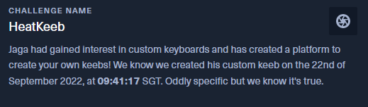
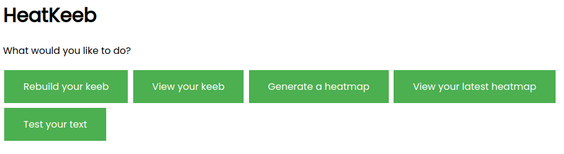
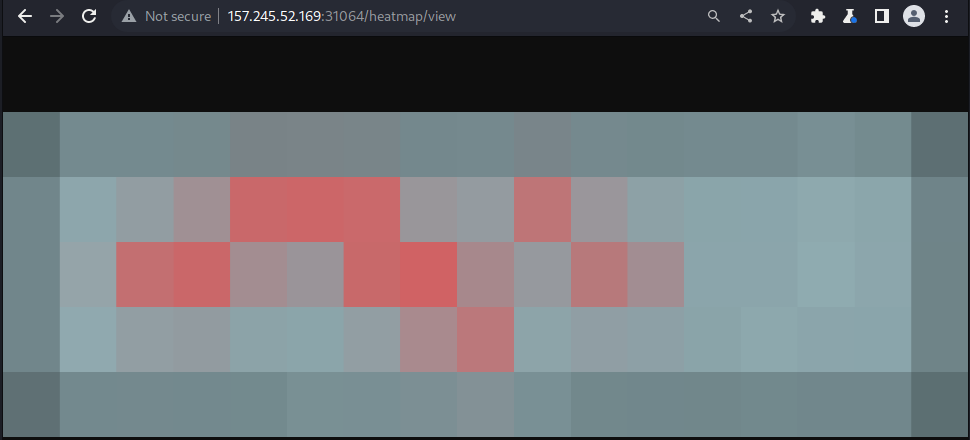
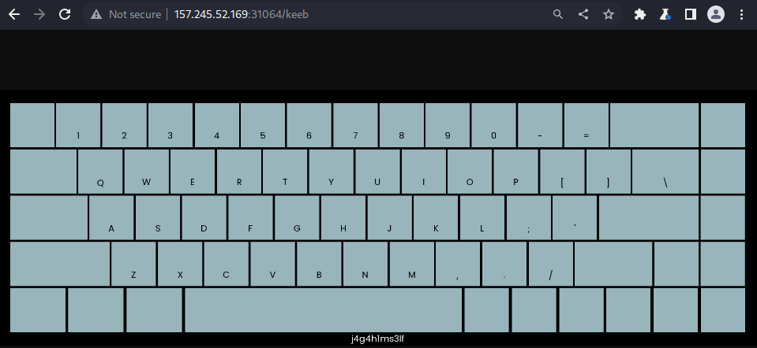
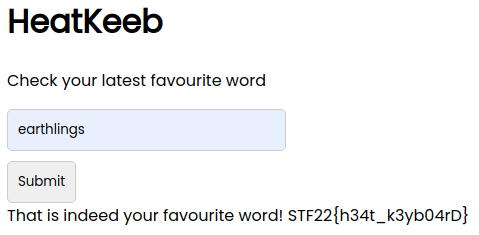

# HeatKeeb - STF22 Miscellaneous Challenge

Here is the challenge task:



Files: [`app.py`](HeatKeeb/app.py), [others files](HeatKeeb)

## Process

For this challenge, the source code of the challenge is provided.
There is a user named Jaga whom we need to obtain some information of.
Right off the bat we get a hint in the challenge string which is a
specific time. This is most likely used as some kind of seed.

Going through [`app.py`](HeatKeeb/app.py), we observe a few notable details.

`/index` submits a form to `/menu` which is looking for a valid token.

```py
@app.post("/menu")
def keeb(request: Request, token: str = Form(...)):
    with shelve.open('keebdb') as db:
        if token in db:
            # set token cookie
            request.session['token'] = token
            return templates.TemplateResponse("menu.html", {"request": request, "token": token})
        else:
            return templates.TemplateResponse("index.html", {"request": request})
```

This token can be seen being generated in `/build` by using the current
time as the seed. This means that we can obtain Jaga's token.

```py
@app.post("/build")
def build(request: Request, name: str = Form(...), frameColor: str = Form(...), keyColor: str = Form(...), textColor: str = Form(...), specialColor: str = Form(...)):
    t = datetime.datetime.now(pytz.timezone('Asia/Singapore'))
    seed = int(t.timestamp())
    random.seed(seed)
    token = ''.join(random.choices('abcdefghijklmnopqrstuvwxyzABCDEFGHIJKLMNOPQRSTUVWXYZ0123456789', k=16))
    with shelve.open('keebdb') as db:
        db[token] = {
            'name': name,
            'frameColor': hex_to_rgb(frameColor),
            'keyColor': hex_to_rgb(keyColor),
            'textColor': hex_to_rgb(textColor),
            'specialColor': hex_to_rgb(specialColor),
            'text': 'default'
        }
    # omitted
```

To obtain the token, we need to parse the date and time given in the hint
into a proper datetime object and use that timestamp as the seed.

```py
def getAdminToken():
    t = (datetime.datetime.strptime("2022-09-22 09:41:17.000000+08:00", "%Y-%m-%d %H:%M:%S.%f%z"))
    seed = int(t.timestamp())
    random.seed(seed)
    token = ''.join(random.choices('abcdefghijklmnopqrstuvwxyzABCDEFGHIJKLMNOPQRSTUVWXYZ0123456789', k=16))
    print({"token": token})
```

Once we obtain the token, we can login as Jaga and we are greeted with the 
menu of several selections. 



We can inspect the source code and note that the flag can be obtained from 
the `Test your text` option in the `/text` module. However, we will be 
required to input a certain text that Jaga saved as his key.

```py
@app.post('/text')
def flag(request: Request, text: str = Form(...)):
    if 'token' in request.session:
        with shelve.open('keebdb') as db:
            token = request.session['token']
            if token in db:
                if token == ADMIN_TOKEN and text.upper() == KEY:
                    return templates.TemplateResponse("flag.html", {"request": request, "word": text, "flag": FLAG})
                elif text.upper() == db[token]['text']:
                    return templates.TemplateResponse("flag.html", {"request": request, "word": text})
    return templates.TemplateResponse("flag.html", {"request": request})
```

This key text is saved during execution and used to generate a heatmap as
hinted by the challenge name. Rather than using the heatmap generation 
module in `/heatmap/generate`, Jaga being the admin generates his own 
tokens and keys near the top of the source code.

```py
with shelve.open('keebdb') as db:
    db[ADMIN_TOKEN] = {
            'name': adminName,
            'frameColor': adminFrame,
            'keyColor': adminKeys,
            'textColor': adminText,
            'specialColor': adminKeys,
            'text': KEY
        }
img = draw_heatmap(adminName, adminFrame, adminKeys, adminText, adminKeys, KEY)
imgSmall = img.resize((int(img.width / 100), int(img.height / 100)), Image.BILINEAR)
result = imgSmall.resize(img.size, Image.NEAREST)
result.save(f'keebs/heatmap-{ADMIN_TOKEN}.png')
```
We can view Jaga's key-generated heatmap using the `View your latest 
heatmap` option in the `/heatmap/view` module.



From here, we can map the heatmap to the keyboard layout that jaga uses.



Note that only the darker shades of pink/red are actual letters and it
was faster to reverse the heatmap manually. Eventually you will obtain 
the letters of `ERTIASGHLN`.

We can simply throw this string into some anagram solver and obtain
jaga's favourite word `EARTHLINGS`.

