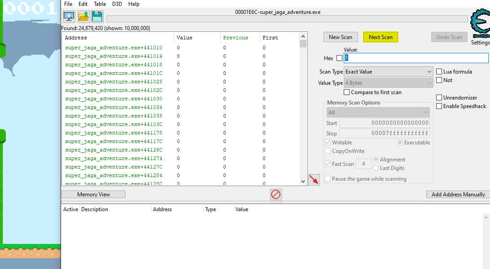

# Jaga Almighty's Grand Adventure - STF22 Miscellaneous Challenge

Here is the challenge task:

Files: [`super_jaga_adventure.exe`](super_jaga_adventure.exe)

## Overview

For this challenge, only a file was provided with no remote server 
available which is expected of a traditional binary reverse engineering 
challenge. This challenge is most likely in the Misc category due to its
unconventional method of solving the challenge, or you could just get the 
flag by passing 69 pipes. 
In short, this executable is ~~flappy bird~~ with a goal.

Starting the executable, we are greeted with a nostalgic screen.

As with most games of the old, cheating is feasible. For that, we use the 
traditional Cheat Engine method. Cheat Engine allows us to attach the 
process and analyse and edit runtime contents of the executable.

Since we would like to pass 69 pipes, we are looking to edit our score to 
69. The first step is to scan for the number 0 which is our current score.

Next, we play the game until we clear 1 pipe. With the score being 1, we
scan for the number 1. By reseting the game, our score goes back to 0 which
we can scan again to narrow down our search.

We can repeat the playing, scanning and reseting process until we single out
the score in memory. We can check that this is indeed our target by playing
further and watching the value increase with our score.

## Solution

Usually at this point, you can double click the value, set it to the number 
you want and enjoy your 9999 score. However, setting this value to 69 did
not spawn any indication of a flag.

One likely reason is that the actual variable we need to set is different
but references this address in some way. We can check which addresses
cross references our found address by pressing `F5`.

Once we open the window, we can continue to play the game and Cheat Engine
will let us know which instruction references our variable.

From the disassembled opcodes, we find that the `RSI` register looks 
suspicious as it is being compared to the number 69 - the number of pipes
we need to pass through. Cheat Engine allows us to automatically change
the register at a certain opcode and we use that to change `RSI` to 69.

Following that, we continue to enjoy the game and notice that the top left
corner of the screen indicates that a flag has been saved to our disk.

We find a `nice_flag.bin` file in the executable's directory with the flag.

