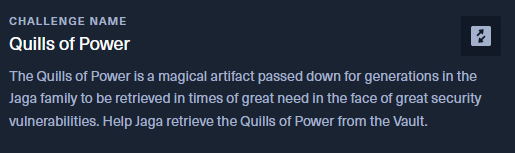
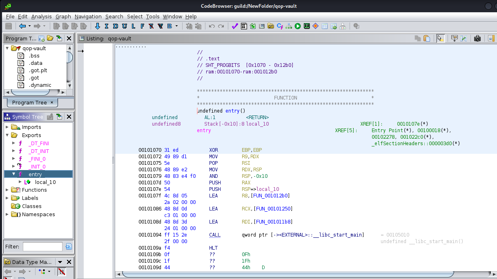
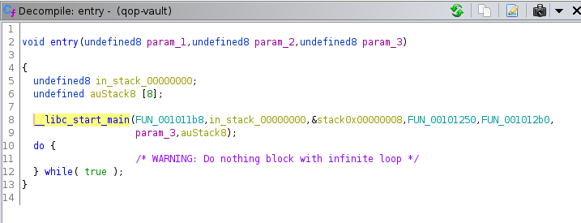
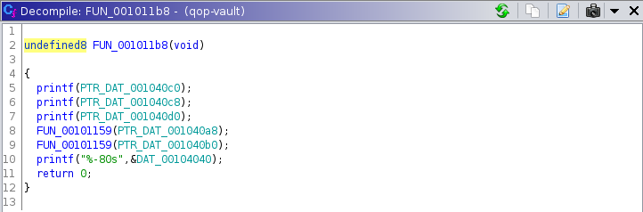
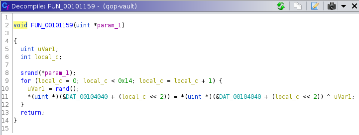
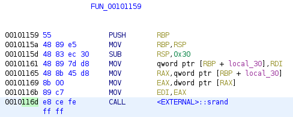
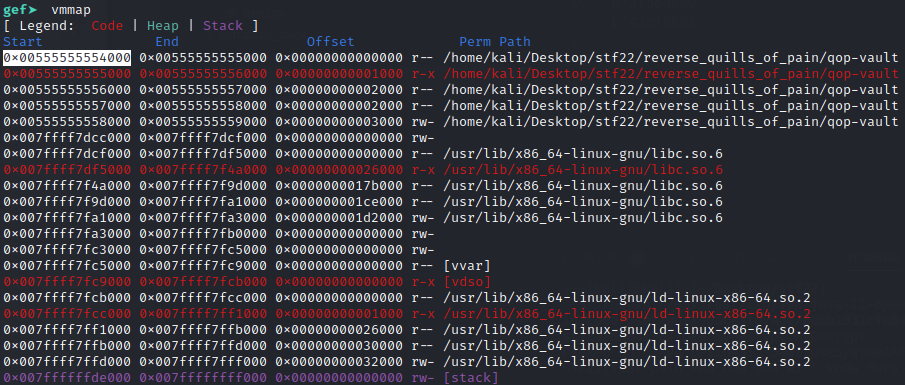
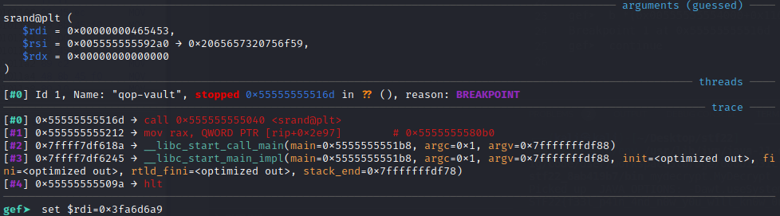
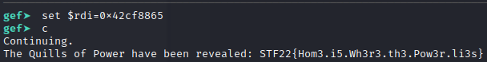

# Quills of Power - STF22 Reverse Engineering Challenge

Here is the challenge task:




Files: [`qop-vault`](qop-vault)

## Overview

For this challenge, only a file was provided with no remote server available
which is expected of a traditional binary reverse engineering challenge.


First, we check that the file is indeed a 64-bit ELF binary and execute it to
see what actions we can immediately perform.
```
$ file qop-vault 
qop-vault: ELF 64-bit LSB shared object, x86-64, version 1 (SYSV), dynamically linked, interpreter /lib64/ld-linux-x86-64.so.2, BuildID[sha1]=ceff22b6d1f1ec4ef1061a8722eaf1cfd722c54a, for GNU/Linux 3.2.0, stripped

$ ./qop-vault 

This Vault contains the Quills of Power, great weapon of Jaga

Unlock in times of need, with the seeds of truth

You see a faint inscription of a map within the Vault...

n
 #
```

From the output, we observe that the binary executes to completion without
any input prompts. The first guess was that it could be potentially accepting
inputs via arguments (which turns out to be incorrect).

Other possibilities include traditional string searches, reversing some 
encryption/decryption algorithm, or some sort of control flow manipulation.
As we will realise later, the last 2 guesses are both valid methods for
solving the challenge.

Next, we analyse the binary in Ghidra and the unfamiliar looking entry which
looks like everything is being handled by a call to `__libc_start_main()`.



In Ghidra, we can open a window which displays the decompiled version
of the displayed assembly code being displayed.



From here, we followed the first function `FUN_001011b8` by double clicking on
it and that it is a function that possibly resembles the output structure when
executing the binary.

* 3 printf strings ("*This Vault contains...*")
* attempts to decode flag
* printf decoded flag ("*n&nbsp;&nbsp;&nbsp;&nbsp;&nbsp;&nbsp;&nbsp;#*")



We inspect the potential flag decoding function and find that it is likely
doing what we expect.



This function makes use of `srand()` to set a seed used for its 
Pseudo-Random Number Generator (PRNG).
Subsequently, it calls `rand()` to generate a random number for each 
interation and XORs the portion of the encrypted flag with it.

On the left side of Ghidra, we can observe the assembly instructions for
this function.



From here, we can obtain the offset to the `srand()` call from the binary's
base address. As Ghidra loads the Image Base at 100000 by default, we only
take the last 4 hex digits.

However, we have a problem. While we are now able to locate and replace the 
argument being fed inside the assumed flag decoding function, we do not have
the necessary seed that is being used for the PRNG.

After awhile, we stumbled upon `map.py` when `binwalk`-ing the binary (which
could also be found if we used `strings`).

```
$ binwalk qop-vault 

DECIMAL       HEXADECIMAL     DESCRIPTION
--------------------------------------------------------------------------------
0             0x0             ELF, 64-bit LSB shared object, AMD x86-64, version 1 (SYSV)
8220          0x201C          Zip archive data, at least v2.0 to extract, compressed size: 243, uncompressed size: 352, name: map.py
8551          0x2167          End of Zip archive, footer length: 22
```

As it turns out, `map.py` is a seed generator which generates 2 seeds. This 
number matching the amount of seed which we require for 2 calls of the
flag decoding function.

```py
import bs4
import requests

def map():
    url = 'https://www.tech.gov.sg/contact-us/'
    response = requests.get(url)
    soup = bs4.BeautifulSoup(response.content, 'html.parser')
    tag = soup.find(string='FIND DIRECTIONS').parent.parent.parent
    seeds = tag.attrs['href'].split('/')[6][1:].split(',')[:2]

if __name__ == '__main__':
    map()
```

To get the raw seed, we just simply need to add a call to print. However, we need more than just that.

We need to obtain a seed that is usable - that allows us to insert in the 
argument to the flag decoding function. This means that the seed needs to be 
in a hexadecimal format that is appropriate for a float. The seed needs to be
packed in big endian form which is a common representation for floats and
transformed into their hex equivalents.

For that, we inserted the following into the `map()` function.
```py
import struct, binascii
def map():
    # omitted
    for seed in seeds:
        print(binascii.hexlify(struct.pack(">f", float(seed))), seed)
```

From there, we can get our seed!

```
$ python3 map.py                
b'3fa6d6a9'
b'42cf8865'
```

Now we have all the ingredients necessary to solve the challenge.
The order of the seed does not actually matter due to the XOR nature.

<table>
<tr>
    <td>offset to <code>srand()</code></td>
    <td>0x116d</td>
</tr>
<tr>
    <td>first seed</td>
    <td>0x3fa6d6a9</td>
</tr>
<tr>
    <td>second seed</td>
    <td>0x42cf8865</td>
</tr>
</table>

## Solution

First, we launch the binary with a
[GDB Enhanced Features (GEF)](https://github.com/hugsy/gef) installed GDB. 
We run `entry` to break at the entry and use `vmmap` to obtain the address
that the binary is being loaded at.



With this address, we can set a breakpoint `b` at the flag decoding function 
and execute until the binary stops at the breakpoint.

```
gef➤  b *(0x00555555554000+0x116d)
Breakpoint 1 at 0x55555555516d
gef➤  continue
```

GEF shows us that we have successfully stopped at the right location, and
displays the guessed arguments to `srand()`. As previously seen, this binary
uses the x86-64 architecture and thus takes in its first argument in the `RDI`
register. We can set this register to our first seed via 
`set $rdi=0x3fa6d6a9`.



Continue the program and it will stop once more, repeat the above process for
the second seed. Once completed, the binary will print out our flag.


