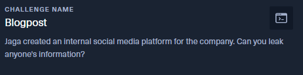
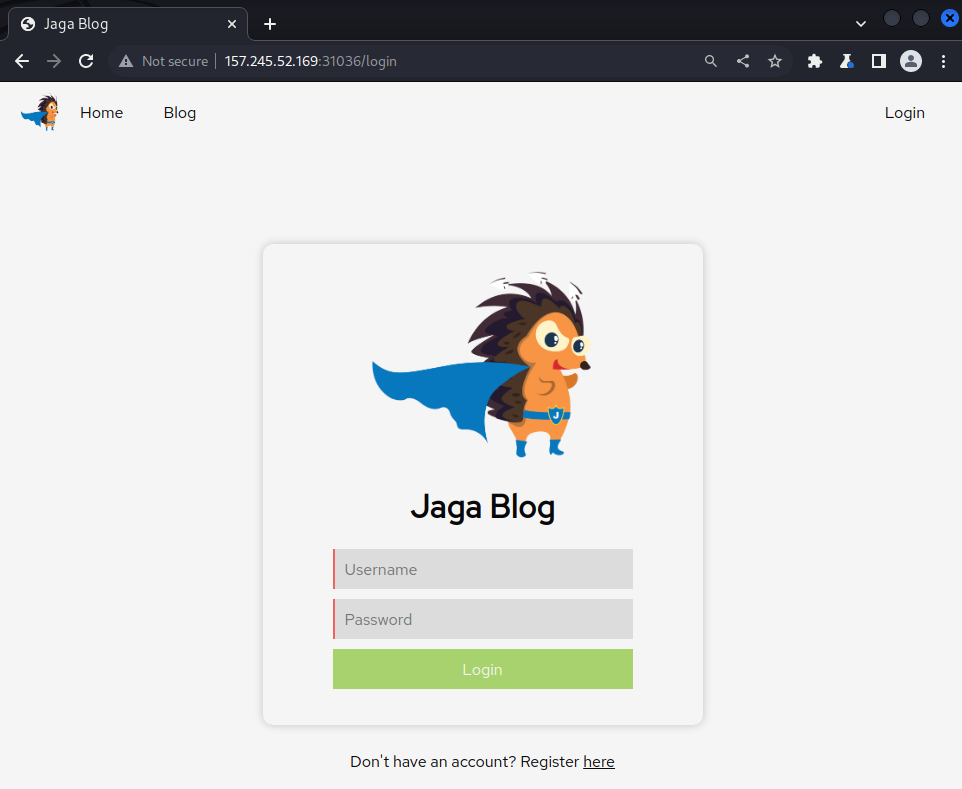
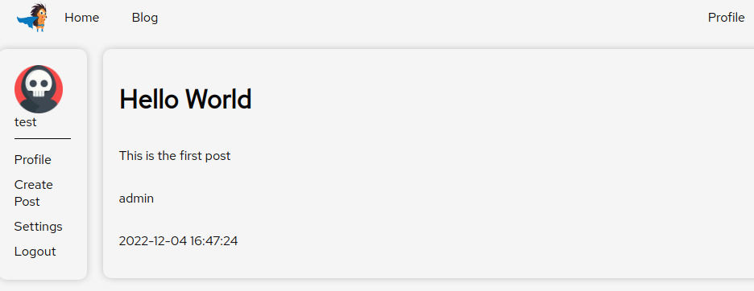
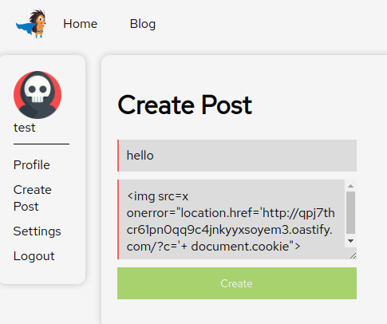
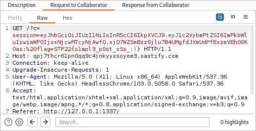

# Blogpost - STF22 Web Challenge

Here is the challenge task:

Files: [`Source Files`](Blogpost/)

## Overview

For this challenge, the source code of the challenge is provided.

Jumping straight into the web application, we are greeted with a login
page. We can get past the login page by registering an account.

Looking through the source files, we spot 
[`bot.js`](Blogpost/src/app/bot.js) which sets the flag for this 
challenge as its cookie and visits the blog. This means that to solve
this challenge, we need to leak that cookie likely via some Cross-Site
Scripting (XSS) methods.

The `Create Post` tab on the left allows us to post a title and message 
onto the blog. From a brief `` that was 
stored and executed, we noted that XSS is possible.

## Solution

For this solution, you will need a proxy or server which you have access
to and can view incoming requests. One such option is 
[Burp Collaborator](
    https://portswigger.net/burp/documentation/collaborator).

This XSS makes use of the `` tag and changes the location of page
when the image fails to load. The page is our Burp Collaborator URL
appended with `?c=document.cookie` to leak the victim's cookie into
a GET request for our URL.

By checking the recorded incoming request, we obtain our flag.

