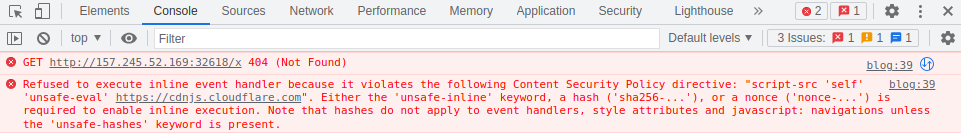

# Blogpost 2 - STF22 Web Challenge

Here is the challenge task:


Files: [`Source Files`](Blogpost_2/)

## Overview

For this challenge, the source code of the challenge is provided.
There exists a [precursor challenge](../Blogpost/README.md) for context.

Jumping straight into the web application, we are greeted with a login
page. We can get past the login page by registering an account.


Resubmitting our previous solution, we observed that the blog's 
location did not change to our provided URL.


We can open up Developer Tool's Console to view the warning which
tells us why our previous XSS script failed.



There now exists certain Content Security Policies (CSP) which prevents
the execution of scripts from non-whitelisted sourced.

One can observe the CSPs included by checking the response headers of
the request.


```
script-src 'self' 'unsafe-eval' https://cdnjs.cloudflare.com
```

From here, we can observe that there exists an unsafe declaration of a 
CSP. The `script-src` CSP is vulnerable

1. `unsafe-eval` unblocks the `eval()` method
2. scripts from `https://cdnjs.cloudflare.com` is allowed to be executed

## Solution

For this solution, you will need a proxy or server which you have access
to and can view incoming requests. One such option is 
[Burp Collaborator](
    https://portswigger.net/burp/documentation/collaborator).

For the solution, we set the source for scripts to come from 
`https://cdnjs.cloudflare.com/ajax/libs/angular.js/1.4.6/angular.js`.

This opens up a Client-Side Template Injection (CSTI) attack
vector which essentially acts as our stored XSS attack, allowing for
arbitrary JavaScript execution. The AngularJS JavaScript library will 
help to interpret and execute code within `{{double curly braces}}` as 
javascript.


Once submitted, we can check incoming requests to our Burp Collaborator
for the leaked cookie flag.

