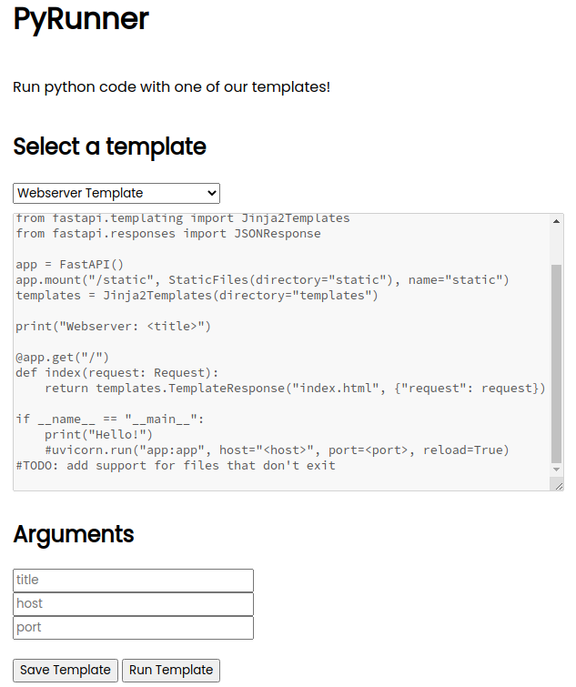
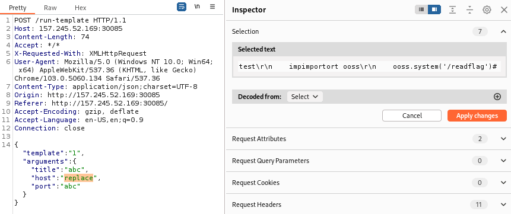
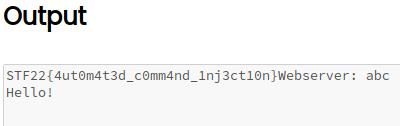

# PyRunner - STF22 Web Challenge

Here is the challenge task:


Files: [`app.py`](PyRunner/app/app.py), 
[`other files`](PyRunner)

## Overview

For this challenge, the source code of the challenge is provided.
As the name suggests, the web application runs a python script with
user arguments replacing certain parts of the script.

In particular, we are interested in the `/run-template` module which
replaces arguments in the 
[`template.py`](PyRunner/app/scripts/template.py) file and executes it.

```py
@app.post('/run-template')
async def run_template(request: Request):
    data = await request.json()
    template = scripts[data['template']]
    with open(f'scripts/{template["file"]}', 'r') as file:
        contents = file.read()
        print(data)
        for argument in template['arguments']:
            contents = contents.replace(f'<{argument}>', textfilter(data['arguments'][argument]))
        filename = f'{random.randint(100000, 999999)}.py'
        with open(f'scripts/{filename}', 'w') as newfile:
            newfile.write(contents)
        output = subprocess.run(['python', f'scripts/{filename}'], capture_output=True, text=True)
        # check if output has error
        if output.stderr:
            return JSONResponse({'output': output.stderr})
        return JSONResponse({'output': output.stdout})  
```

The arguments can be submitted to the web application via a provided
address. From the [`template`](PyRunner/app/scripts/template.py)
displayed, one can observe that the `<host>` and `<port>` arguments
are to be replaced, but trailed by a comment tag `#`. This prevents
any code on the same line from executing.



An additional preventive measure can also be observed, before arguments
are replaced, they are ran through a text filter.

```py
contents = contents.replace(f'<{argument}>', textfilter(data['arguments'][argument]))
```

This text filter attempts to sanitise the arguments by removing
certain disallowed strings - which includes a new line `/n`.

```py
disallowed = ["import", ";", "\n", "eval", "exec", "os"]

def textfilter(text):
    for i in disallowed:
        if i in text:
            text = text.replace(i, "")
    return text
```

## Solution

To solve the challenge, we need to circumvent the various defences
put in place and execute the `/readflag` binary.

For this to work, we need to put our injected code on a new line
and still be able to use strings such as `import` to obtain the
relevant functions. 

The latter is simple due to how the strings are being replaced. 
We can just wrap the replaced string in itslf. The newly
formed string will not be replaced again.

```py
"ooss" --> "os"
"impimportort" --> "import"
```

To circumvent the newline replacement, we borrow the Windows equivalent
of a newline `\r\n`. This makes it such that the newline is not being
interpreted as `\n` and will not be replaced.



Finally, we close off the string with a comment tag to avoid errors.
Once forwarded, the `/readflag` binary will be executed and the flag
is displayed.

