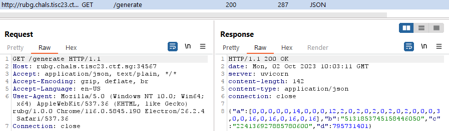

# The Infosecurity Challenge 2023

> TISC 2023 is a two week Capture-the-Flag challenge organised by the Centre for Strategic Infocomm Technologies. The challenges are to be completed in a sequence, with increasing difficulty.

This write up details most of the steps taken while solving the challenges. 5 challenges were attempted in under a week, 4 of which were solved with several rabbit holes I dig myself into.

Challenge | Domain(s)
--- | ---
[Level 1 - Disk Archaeology](#level-1disk-archaeology) | Forensics
[Level 2 - XIPHEREHPIX's Reckless Mistake](#level-2xipherehpixs-reckless-mistake) | Crypto
[Level 3 - KPA](#level-3kpa) | Mobile
[Level 4 - Really Unfair Battleships Game](#level-4really-unfair-battleships-game) | Pwn, Misc
[Level 5 - PALINDROME's Invitation (unsolved)](#level-5palindromes-invitation) | OSINT, Misc

---

## Level 1 - Disk Archaeology
### Description
> Unknown to the world, the sinister organization PALINDROME has been crafting a catastrophic malware that threatens to plunge civilization into chaos. Your mission, if you choose to accept it, is to infiltrate their secret digital lair, a disk image exfiltrated by our spies. This disk holds the key to unraveling their diabolical scheme and preventing the unleashing of a suspected destructive virus.
> 
> You will be provided with the following file:
> - md5(challenge.tar.xz) = 80ff51568943a39de4975648e688d6a3
> 
> Notes:
> - challenge.tar.xz decompresses into challenge.img
> - FLAG FORMAT is TISC{<some text you have to find>}
> 
> attached files
> - [challenge.tar.xz](files/L1_Disk_Archaeology/challenge.tar.xz)

### Process/Solution
The file extracted from the tar is `challenge.img`, and as suggested by the challenge title, it is a disk image.


With that in mind, we can use `autopsy` to investigate the image. We added the image as a ext4 partition and a quick keyword search for "TISC" revealed the partial unformatted flag.


We can grab the Fragment number and look it up under the "Data Unit" tab. By looking around, we noted that there is an ELF magic string 2 pages before, at Fragment 164499. On the left pane, the `number of fragment` was increased to 5 and the contents were exported. 

The extracted file is a 64-bit ELF binary that requires `ld-musl-x86_64.so.1` to execute. This library can be obtained via download or installing musl-gcc. After obtaining the library, running the executable gives us the first flag.


## Level 2 - XIPHEREHPIX's Reckless Mistake
### Description
> Our sources told us that one of PALINDROME's lieutenants, XIPHEREHPIX, wrote a special computer program for certain members of PALINDROME. We have somehow managed to get a copy of the source code and the compiled binary. The intention of the program is unclear, but we think encrypted blob inside the program could contain a valuable secret.
>
> attached files
> - [prog.c](files/L2_XIPHEREHPIX's_Reckless_Mistake/prog.c)
> - [XIPHEREHPIX](files/L2_XIPHEREHPIX's_Reckless_Mistake/XIPHEREHPIX)

### Process/Solution

For this challenge, we were given the source file, `prog.c`. From `main()`, we note that the program asks for a password, verifies it against a hash in `verify_password()`, then uses the password to initialize a key that will be used to decrypt the flag.

The target we are looking to exploit is the `initialise_key()` function as seen below. 

Essentially, the key is the cumulative XORs with an array of hashes that stems from the fixed seed "PALINDROME IS THE BEST!". For each bit raised in the password's characters, an XOR with arr[counter] is applied to the key. Since the key is initialized to 0 at the beginning of the function, the key is entirely made up of the chained hashes from arr[].

```c
void initialise_key(unsigned char *key, char *password, int password_length) {
    const char *seed = "PALINDROME IS THE BEST!";
    int i, j;
    int counter = 0;

    uint256_t *key256  = (uint256_t *)key;

    key256->a0 = 0;
    key256->a1 = 0;
    key256->a2 = 0;
    key256->a3 = 0;

    uint256_t arr[20] = { 0 };

    // arr[0] = SHA256(seed)
    calculate_sha256((unsigned char *) arr, (unsigned char *) seed, strlen(seed));

    // arr[i] = SHA256(arr[i-1])
    for (i = 1; i < 20; i++) {
        calculate_sha256((unsigned char *)(arr+i), (unsigned char *) (arr+i-1), 32);
    }

    // key = cumulative XORs of hashes in arr[]
    for (i = 0; i < password_length; i++) {
        int ch = password[i];
        for (j = 0; j < 8; j++) {
            counter = counter % 20;

            if (ch & 0x1) {
                accumulate_xor(key256, arr+counter);
            }

            ch = ch >> 1;
            counter++;
        }
    }
}
```

Due to the nature of XOR being able to eliminate itself when performed twice, the number of possible keys to be initialized is 1048575 - the summation of `20 choose r` for r in [1..20].

We obtained the array of 20 hashes by modifying the C program and writing them out to a file, then used a [python script](#brutepy) to iterate through the million keys. A [modification](#direct_keyc) was also made to the C program to allow us to pass in the key itself as seen below.

From the python script, we would eventually obtain the correct key and thus the flag. Only issue being that both my device and VM are really slow so that somehow took more than a day. In hindsight it might have ran faster if I wasn't writing to a file, but that was a crash issurance while I let it ran overnight.


### direct_key.c
```c
int main(int argc, char **argv)
{
    char password[MAX_PASSWORD_SIZE + 1] = { 0 };
    int password_length;
    unsigned char key[32];

    printf("Hello PALINDROME member, please enter password:");
    password_length = input_password(password);
    show_welcome_msg(password);
}
```

### brute.py
```py
#!/usr/bin/python3
from pwn import *
import itertools
import time

with open("hash_out", "rb") as f:
    init = f.read()

pre = [init[i:i+32] for i in range(0, len(init), 32)]
bucket = list(itertools.chain(*[list(itertools.combinations(pre, i)) for i in range(1,21)]))
bucket_len = len(bucket)
num = 0

while num < bucket_len:
    payload = bucket[num][0]
    for i in range(1, len(bucket[num])):
        # payload XOR hash
        payload = bytes([_a ^ _b for _a, _b in zip(payload, bucket[num][i])])
    try:
        p = process("./direct.out")
        time.sleep(0.1)
        p.sendline(payload)
        p.recvuntil(b'Your secret message ')
        flag = p.recv()
        with open('message.txt', 'ab') as f:
            f.write(flag)
        num = num + 1
        if b'TISC' in flag:
            print(flag)
    except Exception as e:
        print(f"{e}")
    finally:
        time.sleep(0.1)
        p.kill()
```

## Level 3 - KPA
### Description
> We've managed to grab an app from a suspicious device just before it got reset! The copying couldn't finish so some of the last few bytes got corrupted... But not all is lost! We heard that the file shouldn't have any comments in it! Help us uncover the secrets within this app!
>
> attached files
> - [kpa.apk](files/L3_KPA/kpa.apk)

### Process/Solution

This would be the first time I interacted with a mobile CTF challenge to this degree - beyond using only jadx. This challenge was also primarily done on Windows due to virtualisation issues with android-studio.

On the first day I attempted this challenge, I misinterpreted the hints given in the description. With the initial hint saying that the APK is corrupted, accompanied with `But not all is lost!`, made me think that not all the bytes were transferred and thus we have an incomplete APK. Thus, I spent a day or more trying to tackle the wrong challenge.

</br>

Revisiting the description, I decided to download a few APKs and compared their trailing bytes in an attempt to recover them. I noted that for all the observed APKs, they end with "PK" followed by 20 bytes/characters, with the last 3 byte being `00`. Comparing it with our challenge apk, only the last 3 bytes did not follow this pattern and can be altered using `hexedit`.


With the modification, I could finally use the APk with `apktools` and `jadx`. 

From its AndroidManifest.xml, we know that the application is at `com.tisc.kappa`. In the application's MainActivity, we need to make some modifications, recompile them using apktools, and finally [sign the APK](https://github.com/patrickfav/uber-apk-signer) such that it can run.

> :loudspeaker: The modifications are performed in the application's smali code, obtained from apktools. Such as changing if equals zero `if-eqz` to not equals zero `if-nez`, and adding/modifying certain GOTO conditions `goto: cond_1`.

The necessary modifications are in the `onResume()` function.
1. To avoid failing the checks and exiting early
2. To always pass the condition and set the onClickListener which leads to the flag function


In the OnClickListener `c()`, a password will be passed to the flag decryption function `M()` if the provided password is 25 characters. By providing a password of the correct length, a message saying "Getting there..." is supposed to be shown - somehow I was not able to see this but it is non-consequential. 

In function `M()`, the password entered will be hashed and verified against a SHA1 hash. If it matches, the final flag will be generated from the password.


A hint shown on this view also states that "The secret you seek was just written somewhere...".

This is the part where I spent another day, missing an obvious check that I should have done. In this 'rabbit hole' that I dug, I went through a series of attempts to find the secret password.

1. Going through the logs in logcat
2. Going through the android VM's file system and looking for potential modifications/writes
3. Attempting to capture the intent being sent by the application
4. Attempting to analyse libkappa.so native library
5. Attempting to debug its JNI_OnLoad() function seemed to be dynamic

After exhausting ideas, I went back to re-read the decompiled code in jadx. The location of the secret was actually in the `sw()` class and `sw.a()` that was performed before setting the OnClickListener. The `sw.a()` calls a dynamically exported native function `css()` and sets the application's "KAPPA" property to its returned string. Therefore, using `system.getProperty` and printing out the results was sufficient to obtain the secret: `ArBraCaDabra?KAPPACABANA!`.

With the secret, we obtain the flag.


## Level 4 - Really Unfair Battleships Game
### Description
> After last year's hit online RPG game "Slay The Dragon", the cybercriminal organization PALINDROME has once again released another seemingly impossible game called "Really Unfair Battleships Game" (RUBG). This version of Battleships is played on a 16x16 grid, and you only have one life. Once again, we suspect that the game is being used as a recruitment campaign. So once again, you're up!
> 
> Things are a little different this time. According to the intelligence we've gathered, just getting a VICTORY in the game is not enough.
> 
> PALINDROME would only be handing out flags to hackers who can get a FLAWLESS VICTORY.
> 
> You are tasked to beat the game and provide us with the flag (a string in the format TISC{xxx}) that would be displayed after getting a FLAWLESS VICTORY. Our success is critical to ensure the safety of Singapore's cyberspace, as it would allow us to send more undercover operatives to infiltrate PALINDROME.
> 
> Godspeed!
> 
> You will be provided with the following:
> 
> 1) Windows Client (.exe)
>     - Client takes a while to launch, please wait a few seconds.
>     - If Windows SmartScreen pops up, tell it to run the client anyway.
>     - If exe does not run, make sure Windows Defender isn't putting it on quarantine.
> 
> 2) Linux Client (.AppImage)
>     - Please install fuse before running, you can do "sudo apt install -y fuse"
>     - Tested to work on Ubuntu 22.04 LTS
>
> attached files
> - rubg-1.0.0.AppImage
> - [rubg_1.0.0.exe](files/L4_Really_Unfair_Battleships_Game/rubg_1.0.0.exe)

### Process/Solution

For this challenge, I first attempted to debug it in IDA which took too much time. While attempting to do so, I noticed that files were dropped into my `%TEMP%/2ShoqAvZChnSJtr40JJpbVDYZG8` directory.

The dropped/downloaded files includes resources packs, node modules and a `app.asar`, through some brief googling, I found out that this is an electron application and its source can be extracted, modified and ran - with some configurations.

```
npx asar extract .\resources\app.asar .\src
...
npm i
npm install --save-dev electron
npm run start
```


In the extracted code, we can add a proxy to the application such that we can intercept its communications using Burp Suite.




With this, we can intercept the JSON that the game receives, likely for its ship locations.

It was noted that the contents are being loaded from `dist/index.html` which in turn uses the script in `dist/assets/index-c08c228b.js` to execute its battleship game functionalities. At the bottom of the javascript, we find a section which handles the defeat/victory/flawless victory.


From this section, we can trace and understand the code better.

On game start/retry, the function `E()` is called to retrieve the JSON from the GET request to /generate. This also sets the gamestate `i.value` to 1.


While `i.value` is 1, the game is ongoing and each click on the tiles will call the `check_tile()` function which verifies the selected tile against the `hit_ship()` function. This function performs some mathematical checks on the selected tile, based on an array `t.value[]` which obtained its values from function `f()` operating on the received JSON's `"a"` array.

Once verified, the `check_tile()` function will push character into an array `c` based on the JSON's `"b"` and `"c"` integers in `n.value` and `r.value`.

In this function we can also observe that for the flawless victory's `i.value = 4` to be set, the characters in array `c` needs to be pushed in a lexicographical order.


Instead of clicking the tiles in order, I modified the lexicographical string comparison to one that compares string length instead.

```js
if (JSON.stringify(c.value).length === JSON.stringify([...c.value].sort()).length) {
```

To start solving the challenge, since there are only 16x16 tiles and I want to preserve the javascript code as much as possible, I wrote a python script to tell me which tiles I should click.

```py
def f(x):
    l = []
    for i in range(0, len(x["a"]), 2):
        l.append((x["a"][i] << 8) + (x["a"][i+1]))
    return l

def d(x):
    return (t[x//16] >> x % 16 & 1) == 1

x = {"a":[0,0,0,0,0,0,0,0,0,0,0,0,1,0,1,0,1,0,1,0,1,128,0,12,0,0,0,0,14,62,0,0],"b":"14660440649343497790","c":"15201405804022628730","d":2376251030}

t = f(x)
for i in range(256):
    if d(i):
        print(f"row {i//16:<2} -- col: {i%16:<2}")
```

With that, we can obtain the flag.


## Level 5 - PALINDROME's Invitation
### Description
> Valuable intel suggests that PALINDROME has established a secret online chat room for their members to discuss on plans to invade Singapore's cyber space. One of their junior developers accidentally left a repository public, but he was quick enough to remove all the commit history, only leaving some non-classified files behind. One might be able to just dig out some secrets of PALINDROME and get invited to their secret chat room...who knows?
> 
> Start here: https://github.com/palindrome-wow/PALINDROME-PORTAL

### Process/Solution

The challenge description leads us to a GitHub page with a GitHub workflow and actions. 


From briefly looking around, an attempt at making use of the GitHub action to retrieve the secret URL and password did not work. Looking through the executed actions, we noted that the action title `Portal opening` had the failed results of the old workflow.


From here we can observe the secrets.

* Portal URL: `http://18.143.127.62:45938`
* Password: `:dIcH:..uU9gp1<@<3Q"DBM5F<)64S<(01tF(Jj%ATV@$Gl`

Visiting the portal, we can enter the password to obtain a Discord invitation to their secret channel, alongside an authentication token in the comments.


The first attempt at using the token was to attempt at logging into Discord by adding a 'token' key in the local storage - which did not work.

The token was actually a Bot authentication token which can be used to interface with [Discord's API](https://discord.com/developers/docs/intro) as the respective bot - it was noted that there was a number of bots, perhaps some of which were red herrings. You can interface with the Discord API manually by crafting requests such as in python:

```py
import requests

TOKEN = """
   <omitted> 
""".replace(" ", "").strip()
LIMIT = 50

headers = {"authorization": f"Bot {TOKEN}"}
params = {"limit": LIMIT}

get_guild_url = f"https://discord.com/api/v9/users/@me/guilds"
r = requests.get(get_guild_url, headers=headers, params=params)
if r.status_code != 200:
    print(r.text)
    exit()
guilds = r.json()
```

Python also has libraries such as [discord.py](https://pypi.org/project/discord.py/) that I required to help me set the `message_content` intent which allows bots to read server's (guild's) channel messages.

At first, I went through the server messages that the Bot has access to, and joined the server. It was noted that there is another bot named "BetterInvites" that can create invite links and attach roles to users who join via that link. 

Knowing that, I tried many invite links but was not able to find one that could provide me with special privileges - hopefully ones to the Palindrome secret server. It was also noted that in most channels that I joined such as "aa", "zzz", "qqq", the default role @everyone was already admin which means that the invite link had to point to another channel.

Having not gotten any meaningful results in an hour and with the CTF challenge nearing its end, I turned my attention to scouring the various server's Audit Logs, and other permissions.

From there until the end of the challenge, I attempted to enumerate and use various permissions that a Bot could use while inside the Palindrome secret server to elevate myself - such as adding my account to other role. Unfortunately, it seems that the bots did not have much permissions that would be useful, and they were also unable to view their own server permissions which made enumeration difficult.

### Reading Channel Messages
```py
import discord

intents = discord.Intents.default()
intents.message_content = True

client = discord.Client(intents=intents)
TOKEN = """
    <omitted>
""".replace(" ", "").strip()
LIMIT = 50


@client.event
async def on_ready():
    print(f"Logged in as {client.user}")

    channels = client.get_all_channels()
    for channel in channels:
        try:
            if isinstance(channel, discord.CategoryChannel):
                for c in channel.channels:
                    print(f"{'-'*40}\n{c.guild.name} : {c.name} : {c.id}")
                    async for msg in c.history(limit=LIMIT):
                        print(f"[{msg.author}]: {msg.content}")
            elif isinstance(channel, discord.TextChannel):
                threads = channel.threads
                for thread in threads:
                    async for msg in thread.history(limit=LIMIT):
                        print(f"{msg.author}: {msg.system_content}")
            else:
                print(f"{'-'*40}\n{channel.guild.name} : {channel.name} : {channel.id}")    
                async for msg in channel.history(limit=LIMIT):
                    print(f"{msg.author}: {msg.system_content}")
        except:
            continue
        
try:
    client.run(TOKEN)
except Exception as e:
    print(f"[!] {e}")
```

### Reading Audit Logs & Listing Members
```py
import discord

intents = discord.Intents.default()
intents.message_content = True

client = discord.Client(intents=intents)
TOKEN = """
    <omitted>
""".replace(" ", "").strip()
LIMIT = 50


@client.event
async def on_ready():
    print(f"Logged in as {client.user}")
    
    async for g in client.fetch_guilds():
        print(f"{'*'*80}\n[+] {g.name}")
        print("="*40)
        try:
            async for member in g.fetch_members():
                print(member)
        except:
            pass
        print("="*40)
        try:
            async for entry in g.audit_logs(oldest_first=True):
                print(f'{entry.user[:10]} did {entry.action[15:]} >>> {entry.target}')
            l = await g.invites()
            print(*l, sep='\n')
        except:
            continue
    print("-"*80)

try:
    client.run(TOKEN)
except Exception as e:
    print(f"[!] {e}")
```
